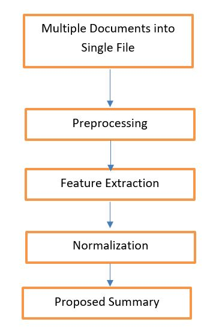

# Medical Document Summarization Using Sentence Feature Extraction and Normalization
In medical world, summaries help the medical domain experts to speedily understand what the article is about and highlight its central idea. The project aims at producing a high quality multi document article summary by taking into account the generic components of an article within a specific domain. The main objective of this system is to generate a summary out of n number of documents related to medical domain by finding a subset of sentences that are summary worthy and contain the most important information of the document.

## Data Flow Diagram

## Steps followed to generate extractive multi-document summary

1. __Pre-Processing__
    * Removal of redundancy: using cosine similarity method, sentences which are structured differently but means the same, are removed.
    * Segementation of sentences: dividing the document into parts based on a delimeter or the boundary detection (e.g., full stop).
    * Removal of stop words: removing most general words like 'a', 'an', 'the', 'above', etc. 

2. __Sentence Feature Extraction__
    * Sentence position: the first sentence is given the highest rank and for subsequent sentences, the positional value decreases.
    * Sentence length: length is calculated by counting the number of words after the stop words are removed.
    * Number of medical terms: domain specific words are counted in a sentence using a domain dictionary.
    * Number of medical acronyms: number of domain specific acronyms are counted in a sentence.

3. __Normalization__
    * Z-score normalization: this is the process of transforming the scores obtained into a range of values.
